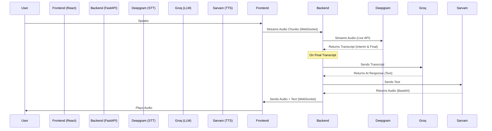

# Engineering Documentation

## Overview
This project is a real-time voice-to-voice AI chat application. It enables users to speak naturally to an AI assistant and receive spoken responses. The system is built with a **React** frontend and a **FastAPI** backend, utilizing state-of-the-art AI models for Speech-to-Text (STT), Large Language Model (LLM) processing, and Text-to-Speech (TTS).

## Architecture

The application follows a client-server architecture using **WebSockets** for real-time bidirectional communication.

## Tech Stack

### Frontend
- **Framework**: React (Vite)
- **Styling**: CSS Modules / Vanilla CSS
- **Audio Capture**: Browser `MediaRecorder` API (WebM/Opus)
- **Communication**: Native `WebSocket` API

### Backend
- **Framework**: FastAPI (Python)
- **Server**: Uvicorn (ASGI)
- **Concurrency**: `asyncio` for handling multiple WebSocket connections and non-blocking API calls.

### AI Services
- **Speech-to-Text (STT)**: [Deepgram Nova-2](https://deepgram.com/product/nova-2)
    - **Why**: Extremely fast, low latency, handles streaming audio natively.
- **LLM**: [Groq](https://groq.com/) (running `llama-3.3-70b-versatile`)
    - **Why**: Groq's LPU inference engine provides near-instant token generation, essential for voice conversations.
- **Text-to-Speech (TTS)**: [Sarvam AI](https://www.sarvam.ai/) (`bulbul:v2`)
    - **Why**: High-quality Indian English/Hindi speech synthesis.

## Data Flow & Implementation Details

### 1. Audio Capture & Streaming
- The frontend uses `navigator.mediaDevices.getUserMedia` to access the microphone.
- A `MediaRecorder` captures audio in `audio/webm` format.
- `dataavailable` events trigger every 250ms (configurable), sending binary blobs to the backend via WebSocket.

### 2. Live Transcription (Deepgram)
- The backend establishes a persistent connection to Deepgram's Live API using the `AsyncDeepgramClient`.
- Audio chunks received from the frontend are immediately forwarded to Deepgram using `send_media()`.
- A background listener task (`start_listening`) waits for transcription events.
- We use `endpointing=True` to detect when the user has finished speaking (silence detection).

### 3. Intelligence (Groq)
- Once Deepgram returns a `is_final=True` transcript, the backend triggers the LLM pipeline.
- The transcript is sent to Groq's Chat Completion API.
- We use a system prompt to ensure concise, conversational responses suitable for voice.

### 4. Speech Synthesis (Sarvam)
- The text response from Groq is sent to Sarvam's TTS API.
- We request `base64` encoded audio.
- **Key Config**:
    - `speaker`: "anushka"
    - `model`: "bulbul:v2"
    - `pace`: 1.2 (slightly faster for natural flow)

### 5. Playback
- The backend sends a JSON message to the frontend containing:
    - `type`: "audio"
    - `data`: Base64 audio string
    - `text`: The text response (for display)
- The frontend decodes the Base64 string and plays it using the HTML5 `Audio` API.

## Key Technical Decisions & Challenges

### WebSocket vs. HTTP
We chose WebSockets over HTTP for audio streaming to minimize latency. HTTP would require creating a new request for every audio chunk (or using multipart), which introduces significant overhead. WebSockets allow a persistent, low-latency pipe for streaming data.

### Deepgram Integration
- **Challenge**: The Deepgram Python SDK v3+ has a specific async pattern. We initially encountered issues with `start()` vs `start_listening()` and event loop management.
- **Solution**: We explicitly create an `asyncio` task for `start_listening()` to ensure the receive loop runs concurrently with the send loop.

### Audio Formats
- **Challenge**: Browser audio formats vary.
- **Solution**: We stream raw `audio/webm` from the browser. Deepgram is configured to auto-detect the encoding, which simplifies the frontend implementation.

## Future Improvements
- **Interruption Handling**: Currently, the AI will finish speaking even if the user interrupts. Implementing "barge-in" would stop playback when new speech is detected.
- **Streaming TTS**: Sarvam returns the full audio file. Streaming the audio bytes as they are generated would further reduce latency.
- **VAD (Voice Activity Detection)**: Implementing client-side VAD could reduce bandwidth by only sending audio when speech is detected.
